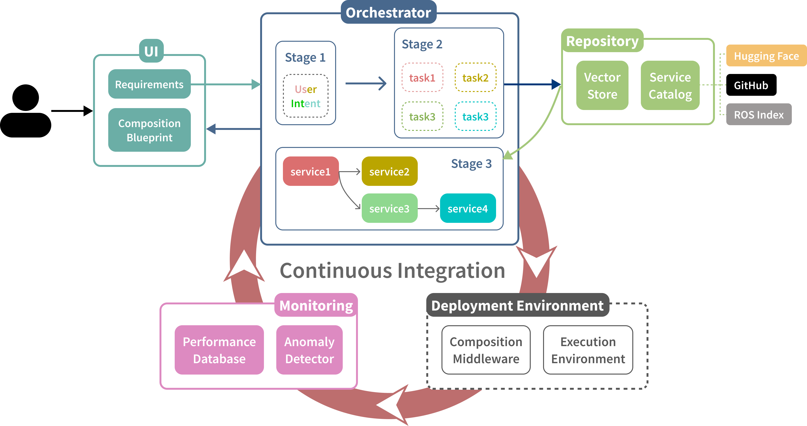
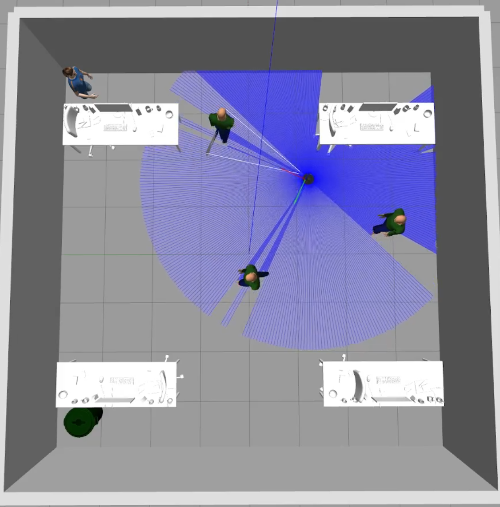
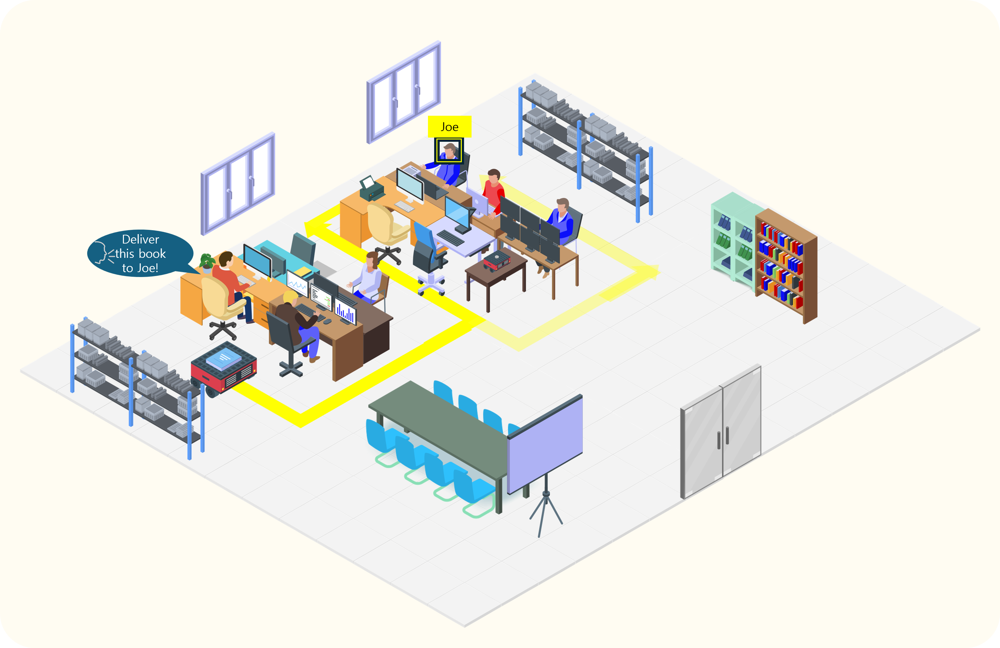

**Table of contents** 
- [1. Introduction](#1-introduction)
- [2. Design](#2-design)
- [3. Scenario](#3-scenario)
- [4. Manual](#4-manual)

## 1. Introduction
This is a CI/CV/CD pipeline framework for software-defined future mobility.

Main features of this pipeline framework is:
* **Continuous Integration (CI)**: Automated service integration of AI-enabled mobility service (e.g., ROS2, Autoware)

* **Continuous Validation (CV)**: Simulation(e.g., Gazebo, CARLA)-based virtual validation of autonomous driving software
 
* **Continuous Deployment (CD)**: Split deployment of moiblity software to mobility device and infrastrucutre (e.g., edge or cloud servers) 

For more details please check the APSEC'25 Tools Paper - [OrchestML](/CI/APSEC_2025_Tools.pdf).

## 2. Design

[Software Requirement Specification](https://docs.google.com/spreadsheets/d/1P-EfpCEkrHRfhBJHL3unYKW5okFbLe2h5jsJ6gXnRrw/edit?usp=sharing)

[Software Designs (Models)](https://drive.google.com/drive/folders/1rNpvV7xWhPPySddRkV-D2rOdhiFWtSDM?usp=drive_link)
- Component diagram
- Sequence diagram

## 3. Scenario

## 4. Manual
For more details regarding the usage of the CI tool, please visit the original repo of OrchestML [here](https://github.com/gurkhaman/OrchestML).